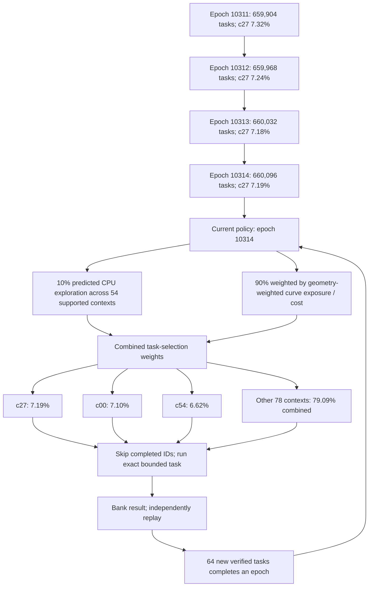
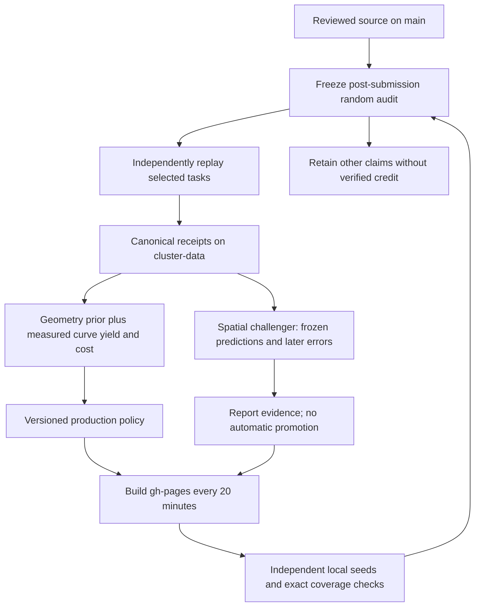
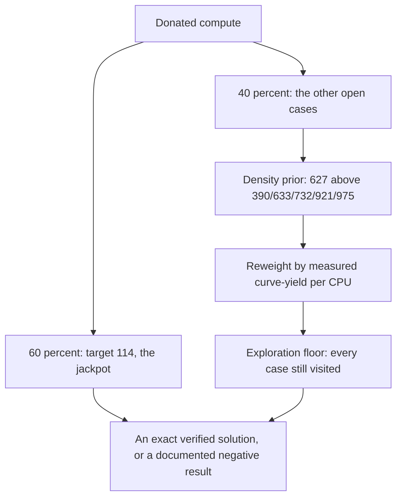
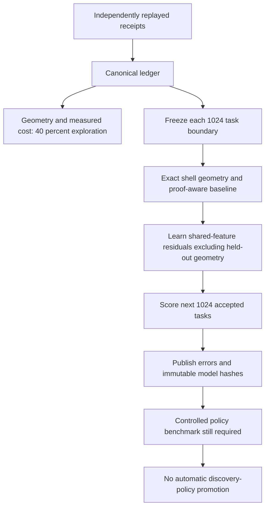

# Math Gambling

The sum-of-three-cubes problem asks which integers can be written as three integer cubes. Our target is **114**, an unresolved case in the literature reviewed for this campaign:

$$x^3+y^3+z^3=114,\qquad x,y,z\in\mathbb{Z}.$$

The coordinates may be positive or negative, and enormous cubes can nearly cancel. An answer is one exactly verified integer triple. There is no known small search bound that guarantees our campaign will contain one.

Our current approach generates modular roots through **cubic-field norms**, rejects impossible candidates with exact arithmetic, and searches 81 explicitly bounded contexts. A shared completed-task index avoids work already known to be finished. Measured cost and a declared geometric prior adjust allocation after each 64 verified tasks. New epochs reserve 40% of predicted CPU for exploration, and exact tile proofs avoid dispatching provably empty work. It has not learned where a solution is likely to be.

This is an open computational research project by Kuber Mehta. The gamble is spare processor time for a possible mathematical discovery. We publish the algorithms, finite search definitions, unsuccessful experiments, verification records and evolving model so the work can be inspected and reproduced.

**[Contribute in your browser →](https://kuber.studio/math-gambling/)** · [Run on your own computer](https://github.com/Kuberwastaken/math-gambling/blob/main/docs/RUNNER_SETUP.md) · [Read the research verdict](https://github.com/Kuberwastaken/math-gambling/blob/main/research/archive/research-2026-09-09/SEARCH_VERDICT.md) · [Read the working paper](https://kuber.studio/math-gambling/paper/)

<!-- MATH_GAMBLING_SNAPSHOT:START -->

## Current verified campaign

Published observation: **2026-09-19 22:39:44 UTC**. This section updates after trusted receipt processing.

| Quantity | Verified total |
| --- | ---: |
| Unique finite tasks | 660,153 |
| Coefficient-generator inputs | 1,329,057,792 |
| Bounded curve intervals | 209,188,170 |
| Logical quotient positions | 87,386,881,960 |
| Exact integer square tests | 178,658 |
| Independently verified identities for 114 | 0 |

These are actual fixed-task units from independent replay, not claimed client seconds or independent chances of discovery. The separate [Mac snapshot](data/mac.json) uses different domains and is not added to these totals.

### Global leaderboard

| Rank | Alias | Authenticated GitHub account | Contributed inputs | Verified inputs |
| ---: | --- | --- | ---: | ---: |
| 1 | Ivan | [@kazenoko-git](https://github.com/kazenoko-git) | 8,607,272,960 | 430,539,776 |
| 2 | [Benjamaxxing](<https://everyreason.bandcamp.com>) | [@EveryReasonTo](https://github.com/EveryReasonTo) | 5,500,797,952 | 713,738,240 |
| 3 | Anish Bhattacharya | [@Anish-MutliTalent](https://github.com/Anish-MutliTalent) | 1,037,347,840 | 54,616,064 |
| 4 | [Anant](<https://anants.studio>) | [@GithubAnant](https://github.com/GithubAnant) | 419,738,624 | 22,299,648 |
| 5 | Aditya | [@adityajatad-spec](https://github.com/adityajatad-spec) | 339,600,384 | 36,933,632 |
| 6 | Varun | [@weavermonkey](https://github.com/weavermonkey) | 75,799,552 | 34,284,544 |
| 7 | kanishk | [@can-ishk](https://github.com/can-ishk) | 12,133,376 | 1,098,752 |
| 8 | [Dr. Ashish Bamania](<https://www.intoai.pub/>) | [@ashishbamania](https://github.com/ashishbamania) | 7,726,080 | 839,680 |
| 9 | robert | [@rsokolewicz](https://github.com/rsokolewicz) | 7,610,368 | 7,610,368 |
| 10 | [1za.ch](<https://1za.ch>) | [@1-zach](https://github.com/1-zach) | 5,324,800 | 704,512 |

**322,713 / 660,153 verified tasks contain no admitted curve intervals.** They remain completed coefficient-domain checks; task counts are not distinct-curve coverage. Exact shell pruning can certify those exclusions without visiting every coefficient individually.

[Mathematical interval export](data/math-coverage/index.json) · [Export scope and limitations](https://github.com/Kuberwastaken/math-gambling/blob/main/docs/MATHEMATICAL_COVERAGE.md)

Rank counts unique contributed inputs: exact replays plus provisional work from complete banks with a matched random audit. The verified column is the exact subset. A failed account audit revokes provisional credit; unchecked claims never certify coverage or train the model. Alias websites are optional and self-declared; account attribution comes from the accepted GitHub issue creator.

### The current allocation

**Epoch 10314**, frozen from **660,096 verified tasks**. The next policy update needs **7 more accepted unique tasks**. The arrows below are regenerated from the current weights and recorded epoch history.

Weights describe task-selection shares, not CPU-time shares or discovery probabilities. 10% of predicted CPU is reserved equally across the 54 supported contexts; 90% follows geometric exp

### Model history and evidence

| Epoch | Verified-task boundary | Largest allocation | Weight |
| ---: | ---: | --- | ---: |
| 10310 | 659,840 | c27 | 7.3743% |
| 10311 | 659,904 | c27 | 7.3186% |
| 10312 | 659,968 | c27 | 7.2368% |
| 10313 | 660,032 | c27 | 7.1830% |
| 10314 | 660,096 | c27 | 7.1915% |

Every accepted task retains its full replay result and server timing. Seeds and dispatch provenance stay with client evidence. Complete policy vectors, historical boundaries and bank decisions remain inspectable:

[Current policy](data/strategy.json) · [Complete model history and bank audits](data/cluster.json) · [Verified task records](data/receipts/tasks/) · [Exact completed-task index](data/coverage/index.json) · [Working paper](https://kuber.studio/math-gambling/paper/)

The separate discovery-learning experiment failed its promotion gate. This campaign learns execution cost and applies a declared geometric prior; it has not established a discovery predictor.

<!-- MATH_GAMBLING_SNAPSHOT:END -->

## The mathematical search

The public engine uses cubic-field norm generators to reach selected large divisors without factoring each one. With $\alpha^3=114$ and $\gamma=a+b\alpha+c\alpha^2$,

$$N(\gamma)=a^3+114b^3+12996c^3-342abc.$$

Adjoint coefficients produce a cube root $r$ of 114 modulo a suitable divisor $D$ when the required inverse exists. Writing $z=r+Dq$ reduces the remaining search to a bounded integer-square condition. Norm-shell bounds, signed congruences, parity and modular square tests eliminate impossible candidates before the exact check. Failed inverses are recorded limitations, not proof that those divisors contain no solution.

The 81 contexts are the Cartesian product of three class multipliers $\ell\in\{1,5,25\}$, three coefficient shapes, three norm shells, and three quotient bands. Here $D_0=\lfloor10^{19}/54\rfloor$; the shells are $(D_0,2D_0]$, $(2D_0,4D_0]$, $(4D_0,8D_0]$, and the ratio bands are $(0,64]$, $(64,256]$, $(256,4096]$, subject to the protocol's minimum-coordinate constraint. [Exact definitions and arithmetic](https://github.com/Kuberwastaken/math-gambling/blob/main/docs/PROTOCOL.md) specify what one completed task excludes.

These finite generators and ratio bands do not cover every integer triple, every modular root, or a complete height box. They can overlap historical searches or the separate Mac campaign. No effective small bound guarantees that a representation lies in our chosen catalogue.

## What the model learns

Every 64 verified tasks freezes a policy. The production method combines a declared geometric band/shell prior with measured curve yield and aggregate CPU. Its exploration reserve is expressed in predicted CPU; actual device costs and discovery probabilities remain uncertain. A separate [shared-feature model](https://github.com/Kuberwastaken/math-gambling/blob/main/docs/LEARNING.md) learns residual workload patterns against a proof-aware baseline, with unseen geometry withheld. The [positive unit-phase experiment](https://github.com/Kuberwastaken/math-gambling/blob/main/docs/UNIT_PHASE_EXPERIMENT.md) tests a distinct generator family separately from production.

[Policy equations and limitations](https://github.com/Kuberwastaken/math-gambling/blob/main/docs/GEOMETRIC_POLICY.md) · [Mathematical coverage scope](https://github.com/Kuberwastaken/math-gambling/blob/main/docs/MATHEMATICAL_COVERAGE.md) · [Branch and deployment design](https://github.com/Kuberwastaken/math-gambling/blob/main/docs/BRANCHES.md)

The initial discovery-learning experiment failed its promotion test. The new geometric preference is uncalibrated for our selected norm families. A stronger sieve, reduced duplicate work and better cost predictions are useful, but none establishes the likelihood of finding 114.

## Studying the whole problem

114 is the jackpot and stays the hook — the majority of compute keeps looking for it. But the same exact search generalizes to every open case below 1000 — **390, 627, 633, 732, 921, 975** — which share the identical structure and differ only in one modular constant and their density. Searching them together **raises the probability of closing _some_ open problem** (627 alone carries roughly twice 114's odds per core-hour) and lets us study the family as a whole rather than a single number.

The generalized search is a sound extension of the 114 engine, not a rewrite. It reuses the same exact scan and final check, is proven in tests to scan a **superset** of the 114 search — so it can never miss a solution the primary engine would find — and drops only k-specific prunes that are optimizations, never correctness. [Engine](https://github.com/Kuberwastaken/math-gambling/blob/main/tools/multi_target.py) · [allocation and bounds](https://github.com/Kuberwastaken/math-gambling/blob/main/tools/target_bounds.py).

Compute is split with an exploration floor, weighted by a declared Heath-Brown density prior and corrected by **measured** cost and yield as data arrives: it learns where computation is cheap and productive, never where a solution "should" be. Bounds tighten per target as empties and unproductive regions accumulate — a low score is a preference, never a proof, and exact emptiness is only ever certified by the shell-interval proof.

<!-- TARGETS:START -->
_Live per-target progress appears here once the cross-target verifier has processed banks._
<!-- TARGETS:END -->

**Status:** the generalized engine and the allocation machinery are built, tested and open here. Wiring the cross-target share into the live cluster is in progress and kept deliberately separate, so the 114 pipeline and everyone's current runners are unaffected. No solution has been found for any target. The website and its jackpot stay centered on 114.

## What verified work means

Browser workers use the Rust WebAssembly kernel with a BigInt fallback. The local runner can use the same fixed-width Rust kernel, with arbitrary-precision arithmetic for the final check and an independent Python reference. [Matched benchmarks](https://github.com/Kuberwastaken/math-gambling/blob/main/research/benchmarks/native-wasm-2026-09-11.json) measured **20.2× native vs Python** and **5.2× WASM vs JavaScript** on this Mac; these are kernel comparisons, not discovery odds or guaranteed whole-campaign speedups. [Build, bounds and tests](https://github.com/Kuberwastaken/math-gambling/blob/main/docs/NATIVE_KERNEL.md). Each result has a fixed task descriptor and deterministic digest. GitHub ingestion fully replays new-account tasks, then samples eligible new negative banks at 1-in-20 after submission. The leaderboard ranks contributed inputs: independently replayed tasks plus provisional unique claims from complete banks that passed at least one random check. Verified inputs are shown separately. Failed account audits revoke provisional credit; unchecked claims never certify coverage or train the model. Submitted seconds and claimed machine speed do not increase the leaderboard. Any candidate identity receives a separate exact cube check, even when its surrounding receipt is malformed. A standalone identity can also be submitted for verification without claiming any completed search tasks; it earns no invented task credit.

The [shared completed-task index](https://github.com/Kuberwastaken/math-gambling/blob/cluster-data/data/coverage/index.json) contains exact task IDs in SHA-256 checked, immutable hash-routed chunks. Runners v0.3.1 and newer read coverage v2; older runners need an upgrade. Clients skip IDs in their checked snapshot and local completed records. There is no probabilistic membership filter that could discard unvisited work. Simultaneous clients can still select the same unfinished task, and stale or offline snapshots cannot know about later completions; the server deduplicates accepted work.

A digest detects changed bytes, but does not prove who physically supplied CPU time. The exact ledger still requires full task replay, but the [negative-audit policy](https://github.com/Kuberwastaken/math-gambling/blob/main/docs/NEGATIVE_AUDITS.md) leaves most eligible claims outside that ledger to reduce replay load. Unsampled claims earn no verified score, train no model and cannot suppress future searches. Existing scores are preserved; score growth after sampling reflects only checked tasks. Expected analytic counts and conservation checks are useful diagnostics; they do not prove that each candidate was visited. See the [protocol](https://github.com/Kuberwastaken/math-gambling/blob/main/docs/PROTOCOL.md), [cluster design](https://github.com/Kuberwastaken/math-gambling/blob/main/docs/CLUSTER.md), and [response to the external critique](https://github.com/Kuberwastaken/math-gambling/blob/main/docs/REVIEW_RESPONSE.md).

## Participate, reproduce and review

Use the [browser](https://kuber.studio/math-gambling/) or the [local runner](https://github.com/Kuberwastaken/math-gambling/blob/main/docs/RUNNER_SETUP.md) to contribute. Keep your saved receipts until the published audit confirms them. The [source archive](https://github.com/Kuberwastaken/math-gambling/blob/main/docs/ARCHIVE.md), [validation record](https://github.com/Kuberwastaken/math-gambling/blob/main/docs/VALIDATION.md), [developer setup](https://github.com/Kuberwastaken/math-gambling/blob/main/docs/DEVELOPMENT.md), and [release evidence](https://github.com/Kuberwastaken/math-gambling/blob/main/docs/RELEASE_STATUS.md) support independent review.

The [working paper](https://github.com/Kuberwastaken/math-gambling/blob/main/paper/math-gambling-draft.tex) records implementation and evidence. Its result and discovery attribution remain blank pending an independently verified and reviewed identity.

## Attribution and license

The mathematical approaches are credited to Booker–Sutherland, Grantham–Walsh and the primary sources in the [research verdict](https://github.com/Kuberwastaken/math-gambling/blob/main/research/archive/research-2026-09-09/SEARCH_VERDICT.md). This independent project is not endorsed by those authors. Original project software is GPL-2.0-or-later; upstream material retains its notices.

[September audit corrections](https://github.com/Kuberwastaken/math-gambling/blob/main/docs/AUDIT_FIXES.md): immediate discovery recovery, bounded warmed replay, exact chunked coverage and the v0.3.1 runner.

<!-- LEARNING:START -->

## Experimental task learning

Frozen through **659,456 verified tasks**; **166 models** and **165 completed forward-window evaluations**. Mode: **shadow**, with no production influence.

The challenger learns residual log-cost and arithmetic exposure from shared coefficient, band and exact shell-bound features. Its comparator already knows provably empty tiles and context costs. Entire geometry cells remain withheld; no discoveries are predicted.

Latest evaluation: tasks 658,433–659,456. Lower mean absolute log1p prediction error is better.

| Quantity | proof baseline | Shared challenger |
| --- | ---: | ---: |
| cpu_ms | 0.3334 | 0.3399 |
| quotient_points | 0.6610 | 0.6388 |
| curves | 0.5695 | 0.5720 |
| exact_tests | 0.1923 | 0.1857 |

Unseen-geometry evaluation: 179 tasks. Full errors and nonzero-count support are in the report.

Historical backfills are retrospective chronological tests, not a randomized A/B experiment. New snapshots remain frozen while later arrivals are evaluated. Arrival time is not computation time; submitted work is selection-biased. Improved prediction error alone cannot promote a search policy.

[Latest report](data/learning/latest.json) · [Frozen model and evaluation records](data/learning/mg114-spatial-shadow-v2/8d62e721df1095e1/) · [Design and promotion protocol](https://github.com/Kuberwastaken/math-gambling/blob/main/docs/LEARNING.md)

<!-- LEARNING:END -->

[13 September controlled search trial](https://github.com/Kuberwastaken/math-gambling/blob/main/docs/GEOMETRY_TRIAL.md): the frozen
geometry ranker measured **+0.37% median weighted exposure per CPU** on fresh
paired seeds (95% bootstrap interval −0.56% to +2.92%). It failed the preset
promotion screen; production allocation remains unchanged. Prediction gains
alone did not establish a useful search gain.
