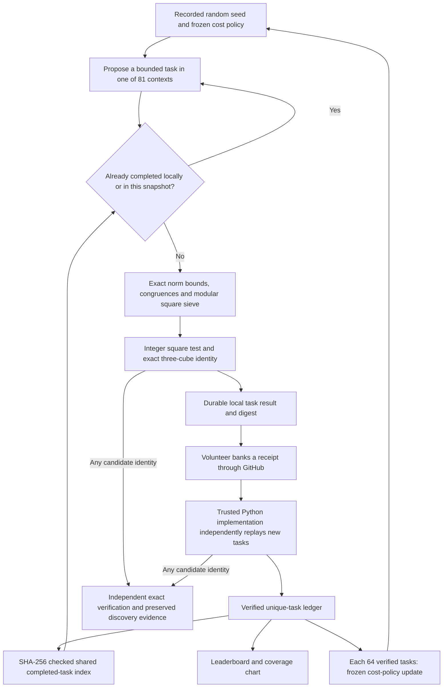

# Math Gambling

Pool spare compute to search for integer solutions of

$$x^3+y^3+z^3=114.$$

**[Let It Ride →](https://kuber.studio/math-gambling/)** · [Local runner setup](docs/RUNNER_SETUP.md) · [Research verdict](research/archive/research-2026-09-09/SEARCH_VERDICT.md) · [Working paper](https://kuber.studio/math-gambling/paper/)

An open computational mathematics experiment by Kuber Mehta. The stake is processor time; the possible reward is a mathematical discovery. No solution to 114 has been found by this project. A fast counter is not evidence that a discovery is approaching.

## From a random proposal to verified coverage



The browser uses `BigInt`; the portable Python kernel uses arbitrary-precision integers. Every task has fixed bounds and a stable ID. Floating point selects work and measures cost; it never decides whether a solution is valid. The local runner can use multiple processes with an explicit worker and time budget.

Receipts are claims until replayed. GitHub ingestion recomputes each unseen task with the trusted Python kernel, compares its deterministic digest, and credits the authenticated issue creator once. Submitted seconds and submitted counters do not determine the leaderboard. A SHA-256 digest detects changed bytes; it does not prove who donated a CPU. Exact candidate identities receive a separate check even when their surrounding receipt is invalid.

## Recorded progress


This chart is generated from the accepted replay ledger. “Verified inputs” means the fixed coefficient-generator positions checked by those tasks. It is not a count of independent discovery chances. The separate [Mac campaign snapshot](data/mac.json) has different domains and accounting; its counts are not added to community counts or converted into interchangeable reference-core-days.

| Quantity | What it records |
| --- | --- |
| Verified unique tasks | Distinct canonical finite tasks accepted after independent replay |
| Generator inputs | Coefficient positions processed by those verified tasks |
| Quotient positions | The bounded integer positions attached to eligible generated roots |
| Exact square tests | Candidates reaching the arbitrary-precision square check |
| Solutions | Triples passing exact integer cube addition |

## Exact shared skip list

[`data/coverage/index.json`](data/coverage/index.json) publishes an exact completed-task index. Its `revision` and `verified_task_count` are the number of accepted unique tasks. Each of the 81 contexts has a shard, including empty contexts:

```text
index: {schema, engine, revision, verified_task_count, updated_at, shards}
shards.c00: {file: "c00-<sha256>.json", sha256: "<sha256>", count: N}
shard: {schema, engine, context: "c00", tasks: [sorted canonical task IDs]}
```

The schemas are `math-gambling-coverage-v1` and `math-gambling-coverage-shard-v1`; the engine is `mg114-offset-v1`. Hashes cover the exact published file bytes, including JSON formatting and its final newline. Clients fetch the index and only the context shards they need, check each hash, and test exact membership. There is no Bloom filter that could incorrectly exclude unvisited work. Malformed, incompatible, oversized or unavailable required coverage stops online dispatch. The native runner's explicit `--offline` mode uses the bundled snapshot and cannot know about later work.

The publisher retains immutable SHA-named files for clients holding older manifests. It writes all new shards before atomically replacing the index, rejects removal or replacement of any previously published task ID, and preserves the same revision and timestamp when coverage has not changed. Version 1 is bounded to a 128 KiB index and 8 MiB / 100,000 IDs per context. Exceeding those limits requires a reviewed format change, never silent truncation.

**This avoids work already known to the client; it is not an exclusive assignment service.** Two devices can choose the same unfinished task, and a stale or offline snapshot can miss recent completions. The server still deduplicates every accepted task. Seeds help audit randomized proposals, but a seed alone does not reproduce an adaptive run: policy revisions, coverage snapshots and the dispatched task records also matter.

## The mathematical search

The public engine uses cubic-field norm generators to reach selected large divisors without factoring each one. With $\alpha^3=114$ and $\gamma=a+b\alpha+c\alpha^2$,

$$N(\gamma)=a^3+114b^3+12996c^3-342abc.$$

Adjoint coefficients produce a cube root $r$ of 114 modulo a suitable divisor $D$ when the required inverse exists. Writing $z=r+Dq$ reduces the remaining search to a bounded integer-square condition. Norm-shell bounds, signed congruences, parity and modular square tests eliminate impossible candidates before the exact check. Failed inverses are recorded limitations, not proof that those divisors contain no solution.

The 81 contexts are the Cartesian product of three class multipliers $\ell\in\{1,5,25\}$, three coefficient shapes, three norm shells, and three quotient bands. Here $D_0=\lfloor10^{19}/54\rfloor$; the shells are $(D_0,2D_0]$, $(2D_0,4D_0]$, $(4D_0,8D_0]$, and the ratio bands are $(0,64]$, $(64,256]$, $(256,4096]$, subject to the protocol's minimum-coordinate constraint. [Exact definitions and arithmetic](docs/PROTOCOL.md) specify what one completed task excludes.

These finite generators and ratio bands do not cover every integer triple, every modular root, or a complete height box. They can overlap historical searches or the separate Mac campaign. No effective small bound guarantees that a representation lies in our chosen catalogue.

## What the model learns

Every 64 new verified tasks completes an epoch. The next frozen policy compares median logical quotient positions per trusted replay CPU millisecond, requires three observations for local adaptation, clips scores, and reserves **40% uniform exploration** across all contexts. The objective is execution efficiency. It is not a probability of discovery, a proof of mathematical fertility, or a claim of global optimality.

A separate discovery-learning experiment held out whole target numbers and a larger divisor range. Learned and uniform mixtures both found the same representation for 69. The learned policy failed its preregistered promotion gate and was not promoted. Patterns in available solution catalogues can suggest experiments, but selection and scale effects prevent treating them as an established location advantage; no new bias significance or discovery probability is claimed here.

| Research decision | Evidence and scope |
| --- | --- |
| Retain the validated norm generator | [Algorithm comparison](research/archive/research-2026-09-09/ALGORITHM_REVIEW.md) reviews Booker–Sutherland, Grantham–Walsh, Elkies and alternatives |
| Retain measured execution optimizations | [Phase 3 performance](research/archive/phase3/PERFORMANCE.md) reports workload-specific gains |
| Reject the stronger sieve for production | [Paired timings](research/archive/research-2026-09-09/normalized-sieve-benchmark.json) found fewer exact tests without an overall CPU gain |
| Do not promote a discovery predictor | [Held-out experiment](research/archive/research-2026-09-09/DISCOVERY_LEARNING.md) failed its acceptance gate |
| Keep complementary geometry as research | [Derived tube bounds](research/archive/research-2026-09-09/GEOMETRY_REVIEW.md) have small-domain checks, not a proven frontier speedup |

An optimization must preserve exact witnesses and its declared finite coverage, then show an end-to-end cost improvement or a properly held-out discovery advantage. Negative experiments stay in the [archive](docs/ARCHIVE.md) so that failures are evidence too. The [working paper](paper/math-gambling-draft.tex) leaves the result and discovery attribution blank.

## Run the site locally

Requires Python 3.11+ and Node.js 22+. Pinned npm packages render Markdown and equations at build time; the published research includes its fonts and works without a rendering service.

```sh
npm ci --ignore-scripts
python3 tools/build_site.py
python3 -m http.server 4173 --directory dist
```

Visit http://localhost:4173/math-gambling/. The build preserves the GitHub Pages project subpath. For the standalone compute program, use the [local runner instructions](docs/RUNNER_SETUP.md).

```sh
npm test
python3 tools/check_site.py
```

## Attribution and license

The mathematical approaches are credited to Booker–Sutherland, Grantham–Walsh and the primary sources in the [research verdict](research/archive/research-2026-09-09/SEARCH_VERDICT.md). This independent project is not endorsed by those authors. Original project software is GPL-2.0-or-later; upstream material retains its notices. See [cluster operation](docs/CLUSTER.md), [archive scope](docs/ARCHIVE.md), and [release evidence](docs/RELEASE_STATUS.md).
