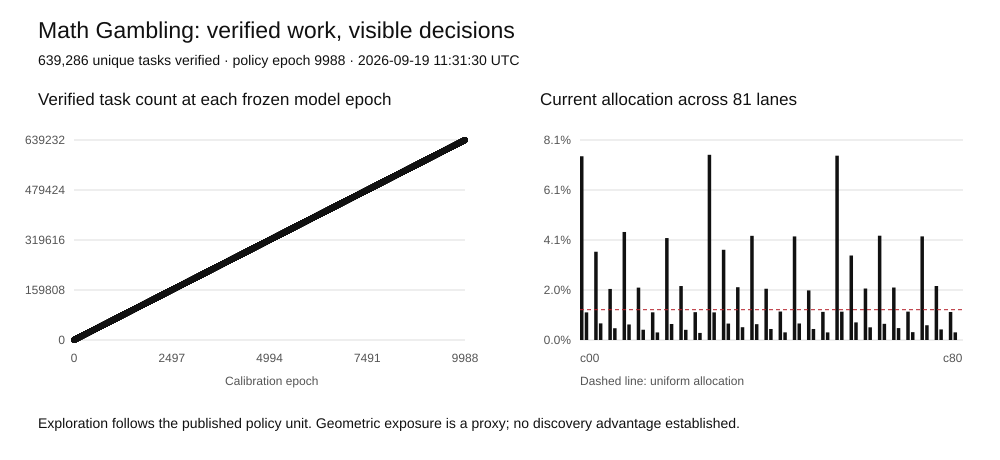
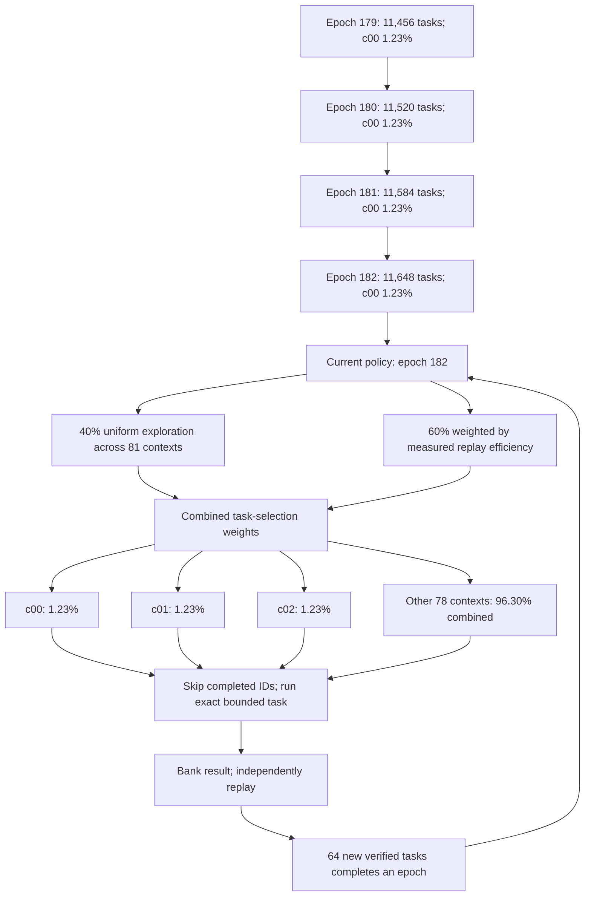

# Math Gambling

The sum-of-three-cubes problem asks which integers can be written as three integer cubes. Our target is **114**, an unresolved case in the literature reviewed for this campaign:

$$x^3+y^3+z^3=114,\qquad x,y,z\in\mathbb{Z}.$$

The coordinates may be positive or negative, and enormous cubes can nearly cancel. An answer is one exactly verified integer triple. There is no known small search bound that guarantees our campaign will contain one.

Our current approach generates modular roots through **cubic-field norms**, rejects impossible candidates with exact arithmetic, and searches 81 explicitly bounded contexts. A shared completed-task index avoids work already known to be finished. A cost model changes how compute is allocated after each 64 verified tasks, while preserving 40% uniform exploration. It has not learned where a solution is likely to be.

This is an open computational research project by Kuber Mehta. The gamble is spare processor time for a possible mathematical discovery. We publish the algorithms, finite search definitions, unsuccessful experiments, verification records and evolving model so the work can be inspected and reproduced.

**[Contribute in your browser →](https://kuber.studio/math-gambling/)** · [Run on your own computer](docs/RUNNER_SETUP.md) · [Read the research verdict](research/archive/research-2026-09-09/SEARCH_VERDICT.md) · [Read the working paper](https://kuber.studio/math-gambling/paper/)

<!-- MATH_GAMBLING_SNAPSHOT:START -->

## Current verified campaign

Published observation: **2026-09-10 19:13:43 UTC**. This section updates after trusted receipt processing.

| Quantity | Verified total |
| --- | ---: |
| Unique finite tasks | 11,649 |
| Coefficient-generator inputs | 21,754,880 |
| Bounded curve intervals | 1,594,339 |
| Logical quotient positions | 2,436,953,304 |
| Exact integer square tests | 5,055 |
| Independently verified identities for 114 | 0 |

These are actual fixed-task units from independent replay, not claimed client seconds or independent chances of discovery. The separate [Mac snapshot](data/mac.json) uses different domains and is not added to these totals.

### Global leaderboard

| Rank | Alias | Authenticated GitHub account | Verified inputs | Unique tasks |
| ---: | --- | --- | ---: | ---: |
| 1 | [Benjamaxxing](<https://everyreason.bandcamp.com>) | [@EveryReasonTo](https://github.com/EveryReasonTo) | 20,079,616 | 10,753 |
| 2 | James | [@JamesT-cmd](https://github.com/JamesT-cmd) | 954,368 | 512 |
| 3 | Pierre | [@pcrooks](https://github.com/pcrooks) | 482,304 | 256 |
| 4 | [Kuber](<https://kuber.studio>) | [@Kuberwastaken](https://github.com/Kuberwastaken) | 238,592 | 128 |

Rank is based on replayed coefficient inputs. Alias websites are optional and self-declared; account attribution comes from the accepted GitHub issue creator.

### The current allocation

**Epoch 182**, frozen from **11,648 verified tasks**. The next policy update needs **63 more accepted unique tasks**. The arrows below are regenerated from the current weights and recorded epoch history.

Weights describe allocation, not the probability that a lane contains a solution. Median replay efficiency, a minimum observation count and clipped scores limit noisy updates; at least 40% uniform exploration remains.

### Model history and evidence

| Epoch | Verified-task boundary | Largest allocation | Weight |
| ---: | ---: | --- | ---: |
| 178 | 11,392 | c00 | 1.2346% |
| 179 | 11,456 | c00 | 1.2346% |
| 180 | 11,520 | c00 | 1.2346% |
| 181 | 11,584 | c00 | 1.2346% |
| 182 | 11,648 | c00 | 1.2346% |

Every accepted task retains its full replay result and server timing. Seeds and dispatch provenance stay with client evidence. Complete policy vectors, historical boundaries and bank decisions remain inspectable:

[Current policy](data/strategy.json) · [Complete model history and bank audits](data/cluster.json) · [Verified task records](data/receipts/tasks/) · [Exact completed-task index](data/coverage/index.json) · [Working paper](https://kuber.studio/math-gambling/paper/)

The separate discovery-learning experiment failed its promotion gate. This campaign currently learns execution cost; it has not established a discovery predictor.

<!-- MATH_GAMBLING_SNAPSHOT:END -->

## The mathematical search

The public engine uses cubic-field norm generators to reach selected large divisors without factoring each one. With $\alpha^3=114$ and $\gamma=a+b\alpha+c\alpha^2$,

$$N(\gamma)=a^3+114b^3+12996c^3-342abc.$$

Adjoint coefficients produce a cube root $r$ of 114 modulo a suitable divisor $D$ when the required inverse exists. Writing $z=r+Dq$ reduces the remaining search to a bounded integer-square condition. Norm-shell bounds, signed congruences, parity and modular square tests eliminate impossible candidates before the exact check. Failed inverses are recorded limitations, not proof that those divisors contain no solution.

The 81 contexts are the Cartesian product of three class multipliers $\ell\in\{1,5,25\}$, three coefficient shapes, three norm shells, and three quotient bands. Here $D_0=\lfloor10^{19}/54\rfloor$; the shells are $(D_0,2D_0]$, $(2D_0,4D_0]$, $(4D_0,8D_0]$, and the ratio bands are $(0,64]$, $(64,256]$, $(256,4096]$, subject to the protocol's minimum-coordinate constraint. [Exact definitions and arithmetic](docs/PROTOCOL.md) specify what one completed task excludes.

These finite generators and ratio bands do not cover every integer triple, every modular root, or a complete height box. They can overlap historical searches or the separate Mac campaign. No effective small bound guarantees that a representation lies in our chosen catalogue.

## What the model learns

Every 64 new verified tasks completes an epoch. The next frozen policy compares median logical quotient positions per trusted replay CPU millisecond, requires three observations for local adaptation, clips scores, and reserves **40% uniform exploration** across all contexts. The objective is execution efficiency. It is not a probability of discovery, a proof of mathematical fertility, or a claim of global optimality.

A separate discovery-learning experiment held out whole target numbers and a larger divisor range. Learned and uniform mixtures both found the same representation for 69. The learned policy failed its preregistered promotion gate and was not promoted. Patterns in available solution catalogues can suggest experiments, but selection and scale effects prevent treating them as an established location advantage; no new bias significance or discovery probability is claimed here.

| Research decision | Evidence and scope |
| --- | --- |
| Retain the validated norm generator | [Algorithm comparison](research/archive/research-2026-09-09/ALGORITHM_REVIEW.md) reviews Booker–Sutherland, Grantham–Walsh, Elkies and alternatives |
| Retain measured execution optimizations | [Phase 3 performance](research/archive/phase3/PERFORMANCE.md) reports workload-specific gains |
| Reject the stronger sieve for production | [Paired timings](research/archive/research-2026-09-09/normalized-sieve-benchmark.json) found fewer exact tests without an overall CPU gain |
| Do not promote a discovery predictor | [Held-out experiment](research/archive/research-2026-09-09/DISCOVERY_LEARNING.md) failed its acceptance gate |
| Keep complementary geometry as research | [Derived tube bounds](research/archive/research-2026-09-09/GEOMETRY_REVIEW.md) have small-domain checks, not a proven frontier speedup |

An optimization must preserve exact witnesses and its declared finite coverage, then show an end-to-end cost improvement or a properly held-out discovery advantage. Negative experiments stay in the [archive](docs/ARCHIVE.md) so that failures are evidence too. The [working paper](paper/math-gambling-draft.tex) leaves the result and discovery attribution blank.

## What verified work means

Browser workers use `BigInt`; the portable Python kernel uses arbitrary-precision integers. Each result has a fixed task descriptor and deterministic digest. GitHub ingestion independently replays every unseen task, compares the full result digest, and credits the actual issue creator once. Submitted seconds and claimed machine speed do not increase the leaderboard. Any candidate identity receives a separate exact cube check, even when its surrounding receipt is malformed. A standalone identity can also be submitted for verification without claiming any completed search tasks; it earns no invented task credit.

The [shared completed-task index](data/coverage/index.json) contains exact task IDs in SHA-256 checked, immutable hash-routed chunks. Runners v0.3.1 and newer read coverage v2; older runners need an upgrade. Clients skip IDs in their checked snapshot and local completed records. There is no probabilistic membership filter that could discard unvisited work. Simultaneous clients can still select the same unfinished task, and stale or offline snapshots cannot know about later completions; the server deduplicates accepted work.

A digest detects changed bytes, but does not prove who physically supplied CPU time. Full negative replay is the current trust model and creates a central cost. Expected analytic counts and conservation checks are useful diagnostics; they do not prove that each candidate was visited. See the [protocol](docs/PROTOCOL.md), [cluster design](docs/CLUSTER.md), and [response to the external critique](docs/REVIEW_RESPONSE.md).

## Participate, reproduce and review

Use the [browser](https://kuber.studio/math-gambling/) or the [local runner](docs/RUNNER_SETUP.md) to contribute. Keep your saved receipts until the published audit confirms them. The [source archive](docs/ARCHIVE.md), [validation record](docs/VALIDATION.md), [developer setup](docs/DEVELOPMENT.md), and [release evidence](docs/RELEASE_STATUS.md) support independent review.

The [working paper](paper/math-gambling-draft.tex) records implementation and evidence. Its result and discovery attribution remain blank pending an independently verified and reviewed identity.

## Attribution and license

The mathematical approaches are credited to Booker–Sutherland, Grantham–Walsh and the primary sources in the [research verdict](research/archive/research-2026-09-09/SEARCH_VERDICT.md). This independent project is not endorsed by those authors. Original project software is GPL-2.0-or-later; upstream material retains its notices.

[September audit corrections](docs/AUDIT_FIXES.md): immediate discovery recovery, bounded warmed replay, exact chunked coverage and the v0.3.1 runner.
