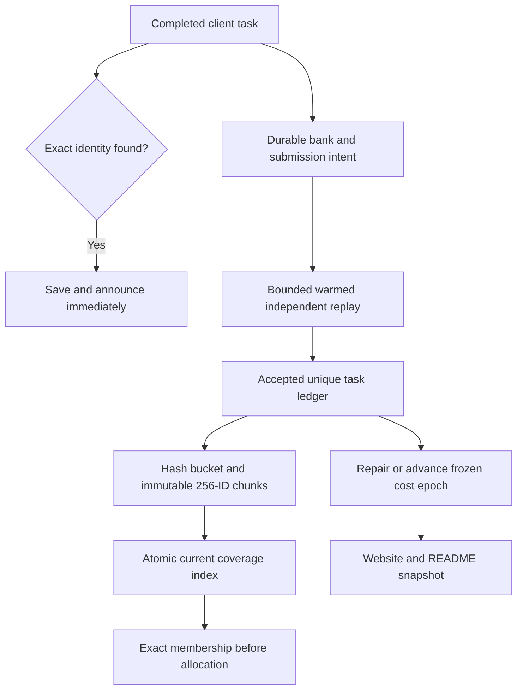

# September 2026 audit corrections

The full-stack audit found failure paths that passing ordinary tests had missed. Runner v0.3.1 and the corresponding site/server updates address them without changing canonical search tasks, receipt hashes, or the requirement for full independent negative replay.

| Finding | Correction | Regression evidence |
| --- | --- | --- |
| A hit remained inside a task until hashing completed | Synchronous independently checked identity callback, immediate worker event/durable file | Positive followed by hash or later-row failure |
| Restart ignored saved discoveries | Startup verifies and recovers saved identities for priority banking | Saved positive recovery without new task allocation |
| Deleted pending issue blocked ingestion | 404/410 source-unavailable audit and queue continuation | Two consecutive unavailable-source scans |
| Browser history scan was quadratic | Covered ID set computed once | 10,000-task dispatch: 3.835 s before, 1.497 ms after on the same test host |
| Report request blocked Stop | Abortable bounded single-flight fetch outside the persistence barrier | Stalled 64th-completion report with successful Stop |
| Late result acquired another session's seed | Per-worker immutable provenance | Old result after replacement seeded session |
| Explicit seed restarted the selection stream | Durable generator state/checkpoint recovery | Same-seed resumed allocation |
| Operational failures returned success | Structured failure reason and nonzero exit after preserving work | Worker and coverage failure status |
| Moving output broke queued bank paths | Relative paths and legacy relocation | Moved checkpoint bank resolution |
| Interrupted epoch update lost history | Deterministic history repair from verified ledger | Interruption between strategy and history writes |
| Positive rescue silently stopped at 64 candidates | Scan the full bounded envelope | Known positive after 64 invalid candidates |

Submission intent is also persisted before issue creation. An uncertain dispatch is reconciled instead of automatically creating another issue.

## Verification and coverage scaling

The server keeps a bounded warmed trusted subprocess rather than rebuilding Python/filter state for every task. Individual task CPU/wall limits, output caps, process retirement, exact result checks, and early positive preservation remain enforced. Failures retire the worker before reuse. The scheduler still learns measured kernel cost, not a discovery probability.

Coverage v2 hashes canonical task IDs into 256 buckets per context and stores sequence-stable chunks of at most 256 IDs. New accepted work only changes a partial tail and context descriptors; sealed chunks are reused. Clients fetch the relevant bucket and keep bounded in-memory caches. This removes the v1 100,000-ID context cap. Root/context byte limits remain explicit operational limits, so the service is not unbounded.

Unreferenced coverage files are kept for at least 24 hours before retirement. Current referenced files are never retired. A very old suspended client must refresh when an expired file is unavailable; unavailable coverage cannot silently exclude work. Offline ZIPs contain every referenced file. Upgrade older runners to v0.3.1 while retaining their output folders and valid banks.

These corrections do not establish exhaustive coverage, calibrated winning odds, or a globally optimal algorithm. The portable runner remains a different implementation from the optimized native C/PARI research campaign. Any compiled-kernel or discovery-policy promotion still requires independent validation on identical held-out work.
