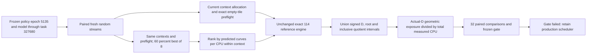

# Can the frozen model improve actual search allocation?

**13 September 2026: no meaningful advantage demonstrated. Do not promote this
ranker.** Better prediction errors did not translate into a useful measured
improvement over the existing geometry/cost scheduler in this experiment.

This is a controlled local experiment on 114, not a new global coverage claim.
It changes neither production allocation nor volunteer credit.

## Results

Both experiments used 32 paired seeds, two nominal CPU-seconds per arm/seed,
randomized execution order, the same frozen model and the same production policy.
The prespecified exploratory gate was a paired median rate ratio above 1.10 and
a paired bootstrap 95% lower bound above 1.00. Neither experiment passed.

| Experiment | Median learned/current exposure rate | Paired bootstrap 95% interval | Learned wins |
| --- | ---: | ---: | ---: |
| Initial instrumentation pilot | 1.0171 | 1.0033–1.0459 | 22/32 |
| Fresh-seed confirmation, faster score accounting | **1.0037** | **0.9944–1.0292** | 19/32 |

These intervals quantify seed-to-seed variability on this machine, not
uncertainty in the mathematical prior or generalization to other kernels.
The experiments are reported separately, not pooled after changing the timing
instrumentation. The final comparison is consistent with a small benefit or
small loss and excludes a 10% median benefit within this particular bootstrap
analysis. It does not establish exact equivalence.

Confirmation totals:

| Measurement | Current scheduler | Frozen within-context ranker |
| --- | ---: | ---: |
| Actual CPU seconds | 64.277 | 64.458 |
| Completed tasks | 7,209 | 7,120 |
| Curve intervals, unique within each arm/seed | 3,938,244 | 3,823,560 |
| Logical quotient positions, unique within each arm/seed | 1,246,348,185 | 1,205,660,089 |
| Weighted exposure per actual CPU second | 8,871.51 | 8,958.30 |
| Selection CPU seconds | 0.373 | 2.330 |
| Search CPU seconds | 51.410 | 49.748 |
| Interval accounting CPU seconds | 12.457 | 12.341 |

The ratio of pooled rates is about 1.0098; the primary statistic is the median
of the 32 paired rate ratios, not the ratio of pooled totals. No repeated
quotient positions were observed *within* an arm/seed. This says nothing about
overlap with earlier trials, other volunteers or the historical search.

## Frozen design



The challenger retains a 40% ordinary-proposal branch. This is a fraction of
task decisions, not a guaranteed fraction of CPU. The production policy's
context weights and its predicted-CPU exploration reserve remain the common
starting distribution for both arms. The experiment tests ranking *within*
those contexts; it does not test every possible learned global allocation.

The ranker predicts curves and CPU using the existing frozen shared-feature
model. Because candidates in a pool share a context, its geometric prior is a
common factor and cancels from their score. Actual divisor values, roots and
interval endpoints are available only after execution and are used for scoring
the experiment, never as an oracle for selecting a candidate.

Model hash:
`9b341f41ce2dfa5b1ff3f7e6b064a3d90d3c28e3e0e3efe3e8df0563302a3c47`.
Each manifest records the policy hash, source hashes, Python version, machine,
random seed and CPU budget. Manifests were written locally before each run;
this is not an independently timestamped public preregistration. The second
experiment used new seeds after the instrumentation diagnosis. No model was
retrained and no candidate-pool size or gate was tuned from these results.

## What is measured?

For each completed curve, retain `(D, r, s, qlo, qhi)`, with `z = r + D*q`,
`s = x+y`, inclusive integer endpoints and canonical minimal-absolute-z
filtering. Union intervals only when `D`, `r` and `s` agree. Overlapping integer
positions receive no second credit. Each remaining position contributes its
half-unit cell in `t = |z|/D` to

$$
\frac{D_0}{D}\int\frac{dt}{\sqrt{4t^3-1}},
\qquad t\geq\frac{1}{\sqrt[3]{2}-1}.
$$

This continuous score is an **uncalibrated geometric exposure proxy**, not the
expected number of solutions. Quadrature and floating-point endpoints affect
the score only. They cannot skip an integer candidate or certify an exclusion.
The engine retains its exact arithmetic and synchronous identity preservation.

CPU accounting includes candidate generation, exact preflight, feature
extraction, model prediction, in-memory task membership, the reference search,
result hashing and mathematical interval accounting. Final whole tasks can
overshoot the nominal budget; rates use actual CPU. The largest confirmation
overshoot was 0.054 seconds. Filter initialization, JSON report serialization,
disk publication, SQLite persistence and network/coverage downloads are outside
these timings. This is not an end-to-end browser or native client benchmark.

Both arms start with empty experiment-local ledgers. Training-task and global
historical membership are not loaded or excluded. Mathematical distinctness is
therefore local to an arm/seed, and no task is banked or claimed as newly covered.
This intentionally limited experiment does not satisfy all production
[promotion requirements](LEARNING.md#required-gate-before-changing-task-selection).

## Measurement correction

The first run spent roughly 71% of CPU in interval accounting, largely because
each curve used a 256-step numerical integral. This instrumentation dominated
the actual kernel. We retained the result, then replaced only that integral in
the benchmark with six terms of the binomial expansion of the same function.

Above the ordering cutoff, `u = 1/(4*t^3) < 0.0044`. The positive-series
truncation has relative tail below `0.0044^6/(1-0.0044) < 7.3e-15` in exact
arithmetic; floating-point roundoff remains. Tests compare the implementation
against the original quadrature over 506 intervals and exercise sign reflection,
ordering cutoff, overlapping endpoints and invalid records. The faster
instrumentation reduced accounting to about 19% of CPU in the second run.
This is a benchmark improvement, **not a production search speedup**.

## Evidence and reproduction

- [Pilot manifest](../research/benchmarks/geometry-2026-09-13/pilot/preregistered.json)
  and [results](../research/benchmarks/geometry-2026-09-13/pilot/results.json).
- [Confirmation manifest](../research/benchmarks/geometry-2026-09-13/confirmation/preregistered.json)
  and [results](../research/benchmarks/geometry-2026-09-13/confirmation/results.json).
- [Frozen model](../research/benchmarks/geometry-2026-09-13/model.json.gz), frozen
  policy in each experiment directory, and compressed task journals with result
  and curve-event hashes. Large raw curve traces stay out of Git history; the
  intervals can be reconstructed by replaying the canonical tasks.

```sh
python3 -m unittest discover -s tests -p test_benchmark_geometry.py
python3 tools/audit_geometry_trial.py research/benchmarks/geometry-2026-09-13/confirmation/tasks.jsonl.gz --sample 32
```

To run a fresh bounded experiment, decompress `model.json.gz` to a local JSON
file and use a new output directory and seed:

```sh
python3 tools/benchmark_geometry.py --model /tmp/mg-frozen-model.json --policy research/benchmarks/geometry-2026-09-13/confirmation/policy.json --output /tmp/mg-new-trial --seconds 2 --repeats 32 --seed 11420260915
```

The initial quadrature implementation is commit `48392e39e`; the faster
confirmation implementation is `72cb0fab5`. A rerun should preserve the listed
source hashes when reproducing one version. Wall-clock and CPU results need not
be identical across runs or hardware.

## Consequences

Keep this model in shadow. A future challenger should earn its scheduling cost
on distinct weighted exposure before deployment, with an untouched test set and
actual native/WASM costs before any client claim. The present result does not
refute all learning approaches or establish that 114 is patternless. It rejects
the practical case for this particular frozen best-of-eight ranker today.

The separate operational check found a successful verifier run taking 7m39s:
2m10s loading the data branch, 1m56s publishing it, 1m33s ingestion/replay, 28s
learning and 60s reports. Data loading/publication alone occupied 54% of wall
time. [Run 34721647156](https://github.com/Kuberwastaken/math-gambling/actions/runs/34721647156)
and recent Pages runs succeeded; the published 03:13 IST snapshot still showed
1,173 pending banks. The [incremental verifier design](INCREMENTAL_CLUSTER.md)
addresses a more substantial measured bottleneck than this ranker. No service
migration or workflow policy change was made in this experiment.
