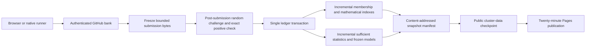

# Incremental verification and submission design

The September 12 audit measured 65% of two successful workflow runs in the data
overlay and publication stages. The source branch is already separate and fetch
is already shallow. Replaying fewer negatives will not remove this bottleneck.

The immediate shipped changes bound the browser projection to 128 actual policy
epochs, preserve all recent bank-reconciliation records, reuse parsed reports
when their ETag is unchanged, and avoid publishing the coverage index twice in a
single verification run. The full authoritative history remains available.

## Recommended next migration

Use a persistent single-writer verifier on the allocated VPS. Its working ledger
is a transactional database; its audit archive is append-only, content-addressed
chunks. GitHub issues continue providing authenticated submission identity.
Publish small current reports and immutable snapshots every twenty minutes.

Required transaction keys are bank content hash, canonical task ID, original
claim ownership, selected audit source, model epoch and publication revision.
Exact verified tasks, provisional claims and mathematical intervals remain
separate tables. Never mark a bank committed before its selected checks and
durable records succeed. A publication outbox records the last externally
acknowledged revision, so crashes retry idempotently instead of double-crediting.

Run the verifier as a dedicated restricted service account with access only to
its ledger and narrowly scoped GitHub credentials. It must not execute issue
text, downloaded model code, pull-request code or client-supplied Python/pickle.
Public repository activity must never turn the agent VPS into a general remote
execution worker. Deploy this only after a backup/restore and crash-recovery
exercise; no new service was deployed as part of the search changes.

## Larger banks without thousands of issues

A protocol-v2 submission can reference a revision-pinned public gist containing
compressed receipt chunks, submitted through one authenticated bank issue.
`gh` authentication remains sufficient; contributors do not need write access to
this repository's releases. The envelope carries immutable revision, chunk
lengths, SHA-256 hashes, task count, engine and contributor alias. The issue
creator remains the source of credited account identity.

The receiver permits only the specified GitHub API origin, rejects arbitrary
URLs and redirects, caps compressed and decompressed bytes, limits tasks and
per-account outstanding work, then freezes the downloaded bytes before drawing
the secret audit sample. It validates each normal canonical task; a bundle does
not expand arithmetic bounds. Retry keys use the complete content hash, not a
user-controlled title. A SHA proves byte identity, not that a client computed.
Gist creation requires the appropriate authenticated scope; manual receipt
export remains available when it is absent.

Do not merely raise the 60 KB issue limit or shorten the ten-second loop again.
Larger submissions need bounded parsing and fair backpressure. They must not let
one contributor monopolize verification. Preserve urgent positive-identity
submission independently of a large negative-work queue.

## Migration acceptance checks

1. Import a pinned snapshot in isolation and reproduce every task digest,
   contributor total, provisional revocation, coverage ID and frozen epoch.
2. Replay the same bounded bank fixtures against old and new ledgers. Results and
   credit must match, including duplicates, changed bodies and late attribution.
3. Interrupt at every transaction/publication boundary, restore from a snapshot,
   and prove no lost accepted work or double credit.
4. Measure accepted tasks/second and p95 bank latency with a million-task ledger,
   including snapshot publication and selected replay. Keep the public queue
   bounded when arrival exceeds capacity.
5. Shadow the live stream read-only first. Cut over at one explicit ledger
   watermark with one writer; retain the old verifier as a rollback/rebuild path.

This is a concrete migration plan, not an already deployed throughput claim.
